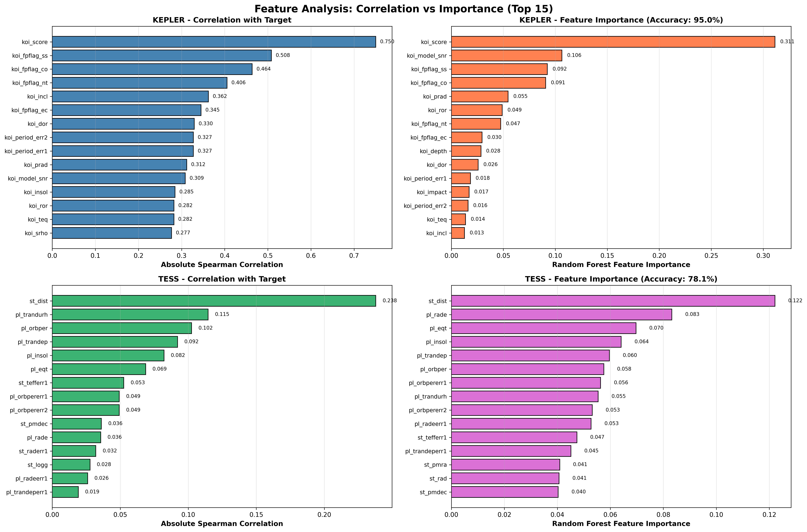
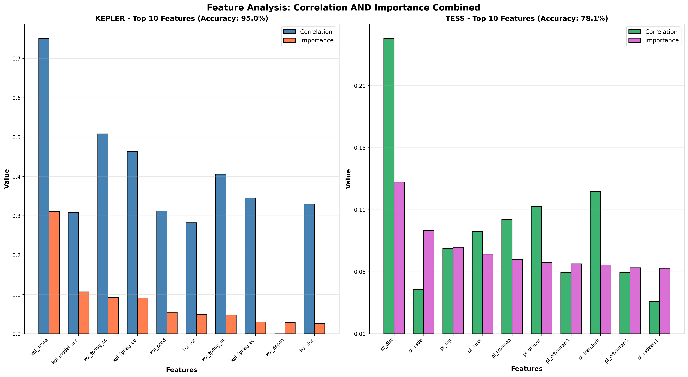

# Exoplanet Classifier - Feature Analysis

Machine Learning project for exoplanet classification.

**Goal:** Classify exoplanets as **CONFIRMED**, **CANDIDATE**, or **FALSE POSITIVE** using data from Kepler and TESS missions.

---

## 📁 Project Structure

```
NASA/
├── Datasets/
│   ├── cumulative_2025.10.04_08.50.10.csv    # Kepler (9,564 exoplanets)
│   ├── TOI_2025.10.04_08.50.19.csv           # TESS (7,703 exoplanets)
│   └── k2pandc_2025.10.04_08.51.50.csv       # K2 (4,004 exoplanets)
│
├── 1_feature_analysis.py                      # Feature analysis (correlation + importance)
│
├── feature_analysis_kepler_tess.png          # Plot: 4 subplots (correlation + importance)
├── feature_analysis_combined.png             # Plot: comparative bars
│
├── .gitignore                                 # Git ignore file
└── README.md                                  # This file
```

---

## 🚀 Usage

### **1_feature_analysis.py**
Feature analysis using:
- **Spearman Correlation** (correlation with target)
- **Random Forest Feature Importance** (classification importance)

**Run:**
```bash
python 1_feature_analysis.py
```

**Output:**
- `feature_analysis_kepler_tess.png` - 4 subplots with correlation and importance
- `feature_analysis_combined.png` - Comparative bars for top 10 features
- Console report with top 10 features per dataset

---

## 📊 Analysis Results

### **KEPLER** (9,564 exoplanets)
- **Accuracy:** 95.0%
- **Usable samples:** 7,898 (82%)
- **Classes:** CONFIRMED (2,746) | CANDIDATE (1,979) | FALSE POSITIVE (4,839)

**Top 10 Features:**
1. `koi_score` - Disposition Score (31.1% importance)
2. `koi_model_snr` - Model SNR (10.6%)
3. `koi_fpflag_ss` - Stellar Eclipse Flag (9.2%)
4. `koi_fpflag_co` - Centroid Offset Flag (9.1%)
5. `koi_prad` - Planet Radius (5.5%)
6. `koi_ror` - Planet-Star Radius Ratio (4.9%)
7. `koi_fpflag_nt` - Not Transit-Like Flag (4.7%)
8. `koi_fpflag_ec` - Contamination Flag (3.0%)
9. `koi_depth` - Transit Depth (2.8%)
10. `koi_dor` - Distance/Stellar Radius (2.6%)

---

### **TESS** (7,703 exoplanets)
- **Accuracy:** 78.1%
- **Usable samples:** 5,272 (68%)
- **Classes:** PC (4,679) | FP (1,197) | CP (684) | KP (583) | APC (462) | FA (98)

**Top 10 Features:**
1. `st_dist` - Stellar Distance (12.2% importance)
2. `pl_rade` - Planet Radius (8.3%)
3. `pl_eqt` - Equilibrium Temperature (7.0%)
4. `pl_insol` - Insolation Flux (6.4%)
5. `pl_trandep` - Transit Depth (6.0%)
6. `pl_orbper` - Orbital Period (5.8%)
7. `pl_orbpererr1` - Period Uncertainty (5.6%)
8. `pl_trandurh` - Transit Duration (5.5%)
9. `pl_orbpererr2` - Period Uncertainty (5.3%)
10. `pl_radeerr1` - Radius Uncertainty (5.3%)

---

## 📈 Visualizations

### Feature Analysis - 4 Subplots


### Feature Analysis - Combined Bars


---

## 🔬 Methodology

1. **Data loading** from CSV files (NASA Exoplanet Archive)
2. **Target encoding** (LabelEncoder for classes)
3. **Correlation calculation** (Spearman) between each feature and target
4. **Random Forest Classifier** (100 trees, max_depth=10) for feature importance
5. **Visualization** of top 15 features by correlation and importance
6. **Final report** with recommended top 10 features

---

## 📝 Important Notes

### **Normalization Required:**
Data is NOT normalized. Only flags (0/1) and `koi_score` are in [0-1] range.

**Examples of ranges:**
- `koi_model_snr`: [0 - 9,054] ❌ Needs normalization
- `koi_prad`: [0.08 - 200,346] ❌ Needs normalization
- `st_dist`: [6.53 - 14,728] ❌ Needs normalization
- `koi_fpflag_ss`: [0 - 1] ✅ Already normalized (binary)

**Recommendation:** Use `StandardScaler` or `MinMaxScaler` before training models.

---

## 🎯 Next Steps

Create `2_preprocessing.py` for:
- Feature normalization
- Handle missing values
- Train/test split
- Prepare data for model training

---

## 👥 Team

NASA Exoplanet Classification Team

---

## 📄 License

NASA Space Apps Challenge 2025
